# MiniMind 训练与阶段结果记录

本文档用于汇总本人在 MiniMind 项目中的阶段性实验结果，当前先整理训练过程证据（SwanLab 截图）和初步结论，后续将继续补充客观评测与主观样例对比。

## 1. 实验链路

当前已完成的训练流程：

- Pretrain
- Full SFT
- LoRA（medical）
- DPO

本阶段先展示 loss 与 learning rate 曲线，作为训练稳定性与收敛趋势的直接证据。

## 2. 训练结果截图

### 2.1 Pretrain

- 配图来源：`images/result/pre_768_loss.png`

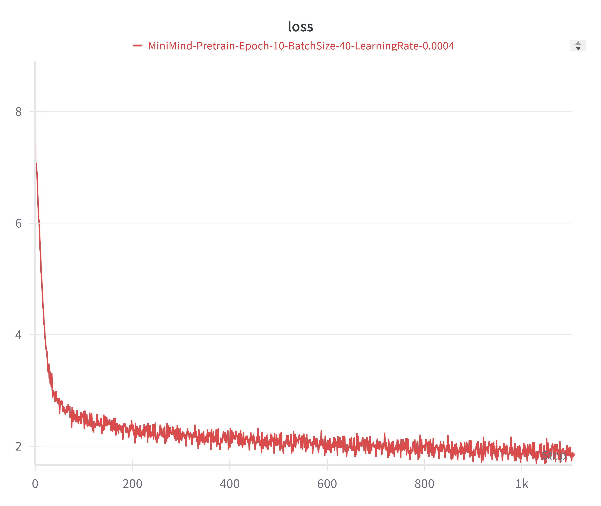

初步观察：

- 整体 loss 呈下降趋势，说明预训练阶段有效学习到基础语言建模能力。
- 曲线后段存在小幅波动，属于小模型训练中的常见现象。

---

### 2.2 Full SFT

本地当前保留了多组 SFT 配置结果，按数据规模与超参数区分如下。

#### SFT-512（Epoch=2, BatchSize=16, LR=5e-6）

- `images/result/MiniMind-Full-SFT-Epoch-2-BatchSize-16-LearningRate-5e-06-sft512-loss.png`
- `images/result/MiniMind-Full-SFT-Epoch-2-BatchSize-16-LearningRate-5e-06-sft512-lr.png`

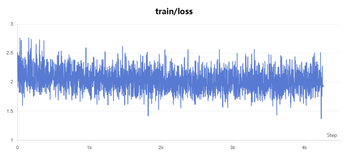

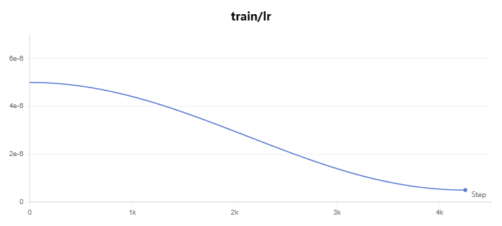

#### SFT-512mini（Epoch=2, BatchSize=8, LR=1e-5）

- `images/result/MiniMind-Full-SFT-Epoch-2-BatchSize-8-LearningRate-1e-05-sft512mini-loss.png`
- `images/result/MiniMind-Full-SFT-Epoch-2-BatchSize-8-LearningRate-1e-05-sft512mini-lr.png`

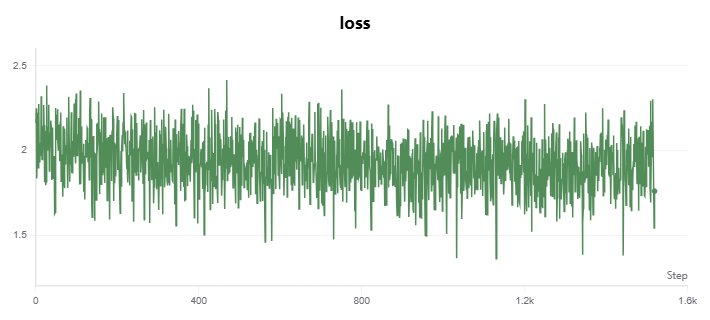

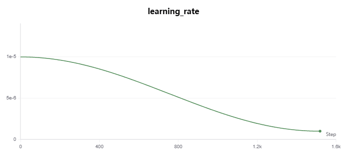

#### SFT-1024（Epoch=1, BatchSize=8, LR=3e-6）

- `images/result/MiniMind-Full-SFT-Epoch-1-BatchSize-8-LearningRate-3e-06-sft1024-loss.png`
- `images/result/MiniMind-Full-SFT-Epoch-1-BatchSize-8-LearningRate-3e-06-sft1024-lr.png`

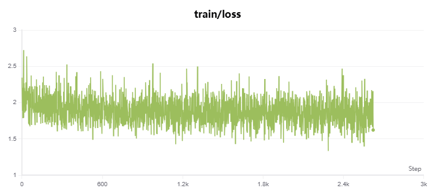

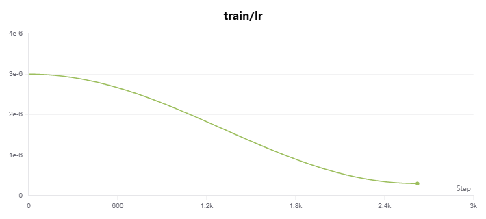

#### SFT-2048（Epoch=1, BatchSize=4, LR=5e-7）

- `images/result/MiniMind-Full-SFT-Epoch-1-BatchSize-4-LearningRate-5e-07-sft2048-loss.png`
- `images/result/MiniMind-Full-SFT-Epoch-1-BatchSize-4-LearningRate-5e-07-sft2048-lr.png`

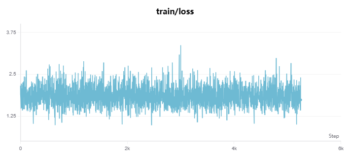

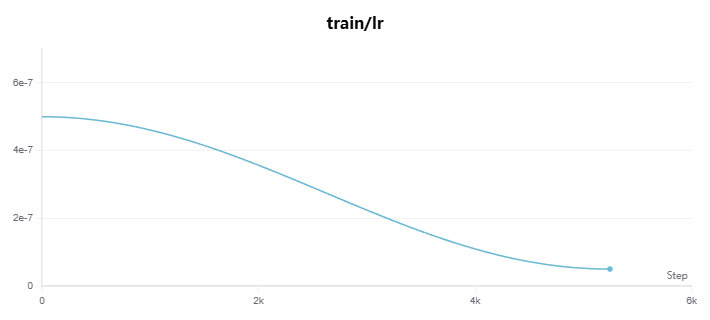

初步观察：

- SFT 阶段总体都能稳定下降，说明指令数据对齐有效。
- 不同序列长度和学习率下收敛速度差异明显，较高 LR 在前期下降更快，但需要关注后期震荡。
- 长序列（1024/2048）配置更依赖较小学习率与训练稳定性。

---

### 2.3 LoRA（medical）

- `images/result/MiniMind-LoRA-lora_medical-Epoch-10-BatchSize-32-LR-0.0001-loss.png`
- `images/result/MiniMind-LoRA-lora_medical-Epoch-10-BatchSize-32-LR-0.0001-lr.png`

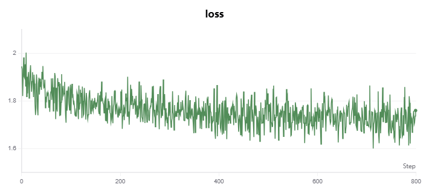

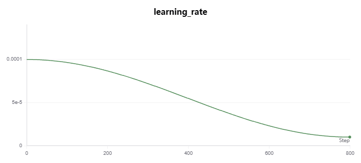

初步观察：

- LoRA 在较少可训练参数下仍能明显优化特定领域能力。
- 曲线整体平稳，说明低成本参数高效微调方案可行。

---

### 2.4 DPO

- `images/result/MiniMind-DPO-Epoch-2-BatchSize-4-LR-4e-08-loss.png`
- `images/result/MiniMind-DPO-Epoch-2-BatchSize-4-LR-4e-08-lr.png`

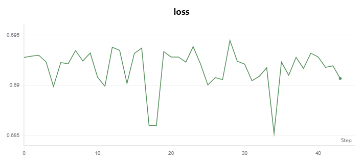

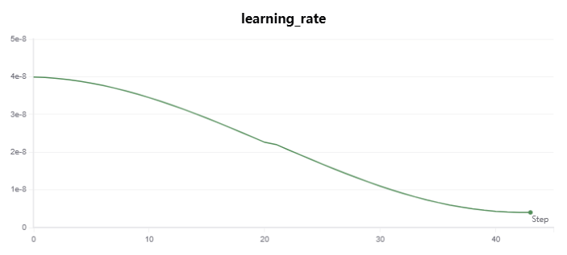

初步观察：

- DPO 阶段以偏好优化为目标，指标含义与 SFT/Pretrain 的 CE loss 不同，不应直接横向比较数值大小。
- 当前训练过程未出现明显发散，后续需结合偏好对比样例验证真实收益。

## 3. 阶段性结论（当前版本）

- 从训练曲线来看，Pretrain -> SFT -> LoRA -> DPO 的流程已完整跑通。
- 各阶段均呈现可解释的收敛趋势，未见严重不稳定或崩溃。
- 已具备撰写完整结果报告的基础证据（训练过程层）。

## 4. 待补充（下一步）

后续将补充以下内容，形成完整的结果论据：

- 客观测评：固定开发集 PPL、第三方 benchmark（如 C-Eval/CMMLU/OpenBookQA）。
- 主观测评：固定测试问题集在不同阶段模型上的输出对比（含失败案例）。
- 成本分析：训练时长、显存占用、推理速度（tokens/s）。
- 汇总表格：关键超参数、最终指标、最佳 checkpoint 对照。

## 5. 结果汇总表（可直接填数）

### 5.1 训练配置与资源消耗

| 阶段 | 数据集 | 关键超参数 | 训练时长 | 峰值显存 | 最终权重 |
|---|---|---|---:|---:|---|
| Pretrain | pretrain_hq.jsonl（或实际文件） | Epoch= , BS= , LR= , MaxLen= | 待填 | 待填 | `out/pretrain_*.pth` |
| Full SFT | sft_mini_512.jsonl（或实际文件） | Epoch= , BS= , LR= , MaxLen= | 待填 | 待填 | `out/full_sft_*.pth` |
| LoRA-medical | lora_medical.jsonl（或实际文件） | Epoch=10, BS=32, LR=1e-4 | 待填 | 待填 | `out/lora/lora_medical_*.pth` |
| DPO | dpo.jsonl（或实际文件） | Epoch=2, BS=4, LR=4e-8, beta=0.1 | 待填 | 待填 | `out/dpo_*.pth` |

说明：

- DPO 指标与 CE/PPL 不同，建议在独立表格中汇报，不与 Pretrain/SFT/LoRA 直接横向比较绝对值。

### 5.2 客观指标（开发集/基准）

| 模型阶段 | Dev NLL | Dev PPL | C-Eval | CMMLU | OpenBookQA | 备注 |
|---|---:|---:|---:|---:|---:|---|
| Pretrain | 待填 | 待填 | 待填 | 待填 | 待填 | 基线模型 |
| Full SFT | 待填 | 待填 | 待填 | 待填 | 待填 | 指令能力提升 |
| LoRA-medical | 待填 | 待填 | 待填 | 待填 | 待填 | 领域能力增强 |
| DPO | 不直接对齐 | 不直接对齐 | 待填 | 待填 | 待填 | 偏好对齐模型 |

补充建议：

- 若暂时没有第三方基准分，可先填 Dev NLL/PPL + 人工评审分，后续补齐。

### 5.3 DPO 专项指标（建议单列）

| 指标 | 数值 | 说明 |
|---|---:|---|
| dpo_loss（final） | 待填 | 训练脚本中的核心优化目标 |
| 偏好胜率（vs SFT） | 待填 | 在固定偏好对上，chosen 胜出比例 |
| 有害/拒答合规率 | 待填 | 安全相关评估（可选） |
| 平均回复长度 | 待填 | 防止模型靠“超短答复”取巧 |

## 6. 主观评测：固定问题集对比

为保证可复现，建议固定一组测试问题（如 50~100 条），并保持推理参数一致（temperature/top_p/max_new_tokens）。

### 6.1 推理参数（统一）

- temperature: 待填（例如 0.7 或 0.85）
- top_p: 待填（例如 0.85）
- max_new_tokens: 待填
- seed: 待填

### 6.2 样例对比模板（可复制多份）

#### Case-01

- 问题：
	- （在此填写）
- Pretrain 输出：
	- （在此填写）
- Full SFT 输出：
	- （在此填写）
- LoRA-medical 输出：
	- （在此填写）
- DPO 输出：
	- （在此填写）
- 结论：
	- （例如：SFT 后格式更稳定，LoRA 在医学术语更准确，DPO 在安全拒答更合理）

#### Case-02（失败样例）

- 问题：
	- （在此填写）
- 现象：
	- （在此填写，例如幻觉、过度拒答、指令遵循不足）
- 可能原因：
	- （在此填写）
- 修复方向：
	- （在此填写）

## 7. 阶段性分析（可用于汇报/答辩）

### 7.1 关键发现

- Pretrain 阶段完成基础语言建模能力构建，loss 下降趋势明显。
- Full SFT 显著提升指令跟随与对话格式稳定性，是效果跃迁最大的阶段。
- LoRA 在低训练成本下可快速注入垂直领域能力，适合任务化迭代。
- DPO 进一步优化偏好对齐与回答风格，但应结合偏好胜率与样例综合判断收益。

### 7.2 当前短板

- 长上下文任务下的稳定性与事实一致性仍需加强。
- 部分问题存在“看似合理但事实不准”的幻觉现象。
- 领域外开放问答能力与通用大模型相比仍有差距。

### 7.3 下一步计划

- 增加固定开发集，按周回归 Dev NLL/PPL 与主观样例。
- 引入第三方基准评测（C-Eval/CMMLU/OpenBookQA），形成可横向比较的成绩。
- 针对失败样例做数据回流（SFT 或 DPO 数据增强）。

## 8. 附录：建议的补图清单

- 训练曲线补充：同一阶段不同超参数的对比图（已部分具备）。
- 评测图补充：各阶段雷达图（正确性、帮助性、安全性、简洁性）。
- 效率图补充：tokens/s 与显存占用柱状图。
